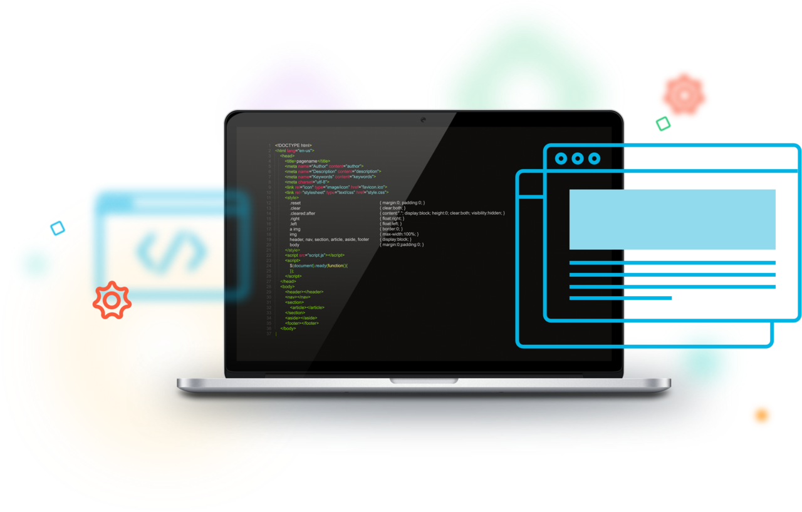
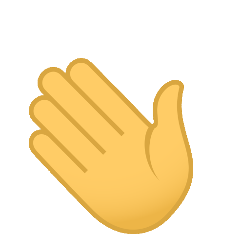

<h1> G’day, fellow geeks</h1>

I’m Mohammad Reza, a junior MERN stack developer, dedicated coder and self-proclaimed designer who specializes in front-end development. My goal is to create websites and apps with next-gen design that is absolutely outstanding.
 
I'm currently studying at the Ferdowsi University of Mashhad in Computer Engineering field.

 

Tech Vault

Also kinda familiar with

Design Vault

 

Languages used

 
 

Let's have a talk sometime 😊

 

Have a laugh before you go!

> What did the ocean say to the beach? Thanks for all the sediment.

By the way, this joke is replaced by github every hour. via majik :)